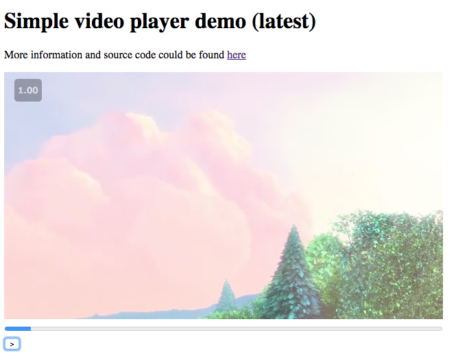

# Simple Video Player [](https://travis-ci.org/vvscode/js--simple-video-player)

This project is meant to show an understanding and ability to use the html `<video>` tag and its API.



### TODO:

* [x] Natives controls must be hidden
* [x] A personalised progress bar must be visible and must be updated during playback
* [x] A custom play/pause button(s) must be implemented and control the video
* [x] Implementation with vanilla javascript (document.querySelector..) or React (jQuery forbidden !!)
* [x] Some units testing. (mocha.. )
* [x] Code hosted on github
* [x] A small description on how you would implement the deployment of your player. (Build, infrastructure, servers, continuous integration, environnements (prod, test..), etc..) 3 or 4 lines
* [x] All “bundle” tools are allowed: webpack, browserify, bower, npm, gulp..
* [x] Bonus: An “end to end” test: Check that if I load the player, the button(s) play/pause is visible (nightwatch.js, etc...)

### Deployment description

And ideal process build based on CI. Be merge into master branch ( only after passing all existing tests ) new tag/release should be created.
Files should be uploaded to CDN with version as part of the path. At the same moment it's possible to create new release for npm.

Regarding test environment - it's worth to deploy each build into separate directory (base on git-hash, for example) - it gives ability to link the page to each PR/ticket.

## How to use it

Add script with player source via
```html
<script src="https://cdn.rawgit.com/vvscode/js--simple-video-player/cf550a2d/dist/simple-video-player.js"></script>
```

Below that insertion use it like

```javascript
(function () {
    new SimpleVideoPlayer({
      el: document.querySelector('.demo-wrapper'), // existing element for rendering to
      url: 'https://s3-eu-west-1.amazonaws.com/onrewind-test-bucket/big_buck_bunny.mp4' // url for the video
    });
  })();
```

Please, keep in mind, that player provided with no-styles ( clean for customising ), but you can use default styles from `demo page` like

```css
    .simple-video-player {
      display: inline-block;
    }
    .simple-video-player .progress-bar {
      width: 100%;
    }
    .simple-video-player [data-role="play-stop"].stopped:after {
      content: '>';
    }
    .simple-video-player [data-role="play-stop"].play:after {
      content: '||';
    }
```
